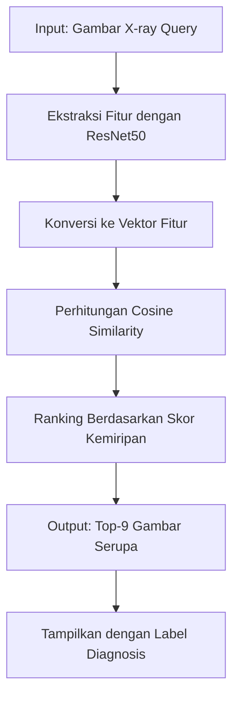

# 🫁 Medical Image Retrieval System for Lung Disease Diagnosis

<div align="center">


**Sistem Pencarian Citra Medis Berbasis Deep Learning untuk Diagnosis Awal Penyakit Paru**

[📊 Dataset](https://www.kaggle.com/datasets/prashant268/chest-xray-covid19-pneumonia) • [💻 Google Colab](https://colab.research.google.com/drive/1fF2QZIh-OR0aHJAMs0A2NIQLMQHDEUYv?usp=sharing) 

</div>

---

## 📋 Daftar Isi

- [Tentang Proyek](#-tentang-proyek)
- [Latar Belakang](#-latar-belakang)
- [Fitur Utama](#-fitur-utama)
- [Teknologi](#-teknologi)
- [Metodologi](#-metodologi)
- [Hasil Evaluasi](#-hasil-evaluasi)
- [Cara Penggunaan](#-cara-penggunaan)
- [Visualisasi](#-visualisasi)
- [Kesimpulan](#-kesimpulan)
- [Kontributor](#-kontributor)

---

## 🎯 Tentang Proyek

Proyek ini mengimplementasikan **Content-Based Image Retrieval (CBIR)** berbasis Deep Learning untuk membantu diagnosis awal penyakit paru-paru menggunakan citra X-ray dada. Sistem ini mampu menemukan dan menampilkan citra X-ray yang serupa dari database beserta label diagnosis historisnya, sehingga dapat mempercepat proses identifikasi penyakit.

### 🎓 Informasi Akademik
- **Peneliti:** Maylani Kusuma Wardhani
- **NIM:** 202210370311123
- **Judul:** Implementasi Sistem Pencarian Citra Medis Berbasis Deep Learning untuk Diagnosis Awal Penyakit Paru Menggunakan Dataset X-ray

---

## 🔬 Latar Belakang

### Masalah Kesehatan Global

- **Pneumonia** menyebabkan lebih dari **700.000 kematian anak** per tahun di seluruh dunia (UNICEF, 2025)
- **COVID-19** dan Pneumonia masih menjadi masalah kesehatan global yang serius (WHO, 2024)
- Foto Rontgen Dada (CXR) penting untuk diagnosis cepat karena biaya rendah dan ketersediaan luas
- Interpretasi CXR masih **subjektif dan bervariasi** antar radiolog (Kemenkes RI, 2024; PubMed, 2023)

### Solusi yang Ditawarkan

Sistem CBIR ini dirancang untuk:
- ✅ Meningkatkan **objektivitas** diagnosis
- ✅ Meningkatkan **efisiensi** analisis citra medis
- ✅ Mempercepat proses **identifikasi awal** penyakit paru
- ✅ Memberikan **referensi visual** dari kasus serupa sebelumnya

---

## ✨ Fitur Utama

### 🔍 Content-Based Image Retrieval (CBIR)
Sistem pencarian citra berdasarkan konten visual, bukan metadata atau teks

### 🧠 Deep Learning dengan ResNet50
Menggunakan arsitektur CNN pre-trained untuk ekstraksi fitur yang akurat

### 📊 Multi-Class Classification
Mendukung deteksi untuk 3 kelas penyakit:
- 🦠 **COVID-19**
- 🫁 **Pneumonia**
- ✅ **Normal (Sehat)**

### 🎯 Top-K Retrieval
Menampilkan 9 citra paling mirip dengan skor kemiripan tertinggi

### 📈 Grad-CAM Visualization
Visualisasi area yang paling berpengaruh dalam keputusan model

---

## 🛠 Teknologi

### Deep Learning Framework
```
- TensorFlow / Keras
- ResNet50 (Transfer Learning)
- ImageNet Pre-trained Weights
```

### Metode & Algoritma
```
- Convolutional Neural Network (CNN)
- Transfer Learning
- Cosine Similarity / Euclidean Distance
- Feature Extraction & Embedding
```

### Dataset
- **Sumber:** [Kaggle - Chest X-ray COVID19 & Pneumonia](https://www.kaggle.com/datasets/prashant268/chest-xray-covid19-pneumonia)
- **Kelas:** COVID-19, Pneumonia, Normal
- **Format:** Citra X-ray Dada (Chest X-Ray)

---

## 🔄 Metodologi

### Alur Kerja Sistem



### 1️⃣ Input: Gambar Rontgen (Query)
Pengguna mengunggah citra X-ray dada yang ingin dianalisis

### 2️⃣ Ekstraksi Fitur dengan CNN
- Model **ResNet50** mengekstraksi fitur visual dari citra
- Lapisan CNN mempelajari pola seperti tekstur, bentuk, dan struktur
- Menggunakan **Transfer Learning** dari ImageNet

### 3️⃣ Konversi ke Vektor Fitur (Embedding)
- Setiap citra direpresentasikan sebagai vektor numerik
- Vektor ini merangkum ciri khas unik dari citra tersebut

### 4️⃣ Pencocokan dengan Database
- Menghitung **Cosine Similarity** antara vektor query dan database
- Mencari citra dengan jarak kemiripan terkecil

### 5️⃣ Output: Hasil Pencarian
- Menampilkan **Top-9 gambar** paling mirip
- Dilengkapi dengan **skor kemiripan** dan **label diagnosis**

---

## 📊 Hasil Evaluasi

### Matriks Performa per Kelas

| Kelas | mAP | P@1 (Akurasi) | P@10 (Precision) | R@10 (Recall) | F1@10 |
|-------|-----|---------------|------------------|---------------|-------|
| **COVID-19** | 0.4481 | 0.9400 | 0.8260 | 0.9800 | 0.8742 |
| **NORMAL** | 0.6420 | 0.9200 | 0.8940 | 0.9800 | 0.9272 |
| **PNEUMONIA** | 0.8107 | 0.9600 | 0.9520 | 1.0000 | 0.9640 |
| **OVERALL** | **0.6336** | **0.9400** | **0.8907** | **0.9867** | **0.9218** |

### 📈 Interpretasi Hasil

#### 🏆 Performa Terbaik: Pneumonia
- **mAP: 0.8107** - Sistem sangat efektif dalam menemukan citra Pneumonia
- **Recall: 100%** - Semua citra Pneumonia relevan berhasil ditemukan
- **F1-Score: 0.9640** - Keseimbangan sempurna antara precision dan recall

#### ✅ Performa Baik: Normal
- **mAP: 0.6420** - Performa solid untuk kelas Normal
- **Precision: 0.8940** - Tingkat akurasi pencarian tinggi

#### 🔄 Performa Moderat: COVID-19
- **mAP: 0.4481** - Performa terendah, kemungkinan karena variasi visual lebih tinggi
- **Recall: 0.9800** - Tetap mampu menemukan hampir semua kasus COVID-19

#### 🎯 Performa Keseluruhan
- **Akurasi (P@1): 94%** - Hasil teratas hampir selalu benar
- **F1-Score: 0.9218** - Performa sangat baik secara keseluruhan

---

## 💻 Cara Penggunaan

### 🚀 Quick Start dengan Google Colab

1. **Buka Notebook**
   ```
   https://colab.research.google.com/drive/1fF2QZIh-OR0aHJAMs0A2NIQLMQHDEUYv?usp=sharing
   ```

2. **Jalankan Semua Cell**
   - Klik `Runtime` > `Run all`
   - Atau tekan `Ctrl+F9`

3. **Upload Citra X-ray**
   - Gunakan cell upload untuk mengunggah citra query
   - Format: JPG, PNG, atau JPEG

4. **Lihat Hasil**
   - Sistem akan menampilkan 9 citra paling mirip
   - Setiap hasil dilengkapi skor kemiripan dan label diagnosis

### 📦 Instalasi Lokal

```bash
# Clone repository
git clone https://github.com/username/medical-image-retrieval.git
cd medical-image-retrieval

# Install dependencies
pip install -r requirements.txt

# Download dataset
kaggle datasets download -d prashant268/chest-xray-covid19-pneumonia

# Run the system
python main.py
```

### 📝 Requirements

```txt
tensorflow>=2.10.0
keras>=2.10.0
numpy>=1.21.0
pandas>=1.3.0
matplotlib>=3.4.0
scikit-learn>=0.24.0
opencv-python>=4.5.0
pillow>=8.3.0
```

---

## 🎨 Visualisasi

### Grad-CAM (Gradient-weighted Class Activation Mapping)

Grad-CAM memvisualisasikan area pada citra X-ray yang paling berpengaruh terhadap prediksi model:

- 🔴 **Area Merah**: Wilayah dengan aktivasi tertinggi (paling penting untuk diagnosis)
- 🟡 **Area Kuning**: Wilayah dengan aktivasi sedang
- 🟢 **Area Hijau**: Wilayah dengan aktivasi rendah

Visualisasi ini membantu:
- ✅ Memahami "pemikiran" model
- ✅ Validasi apakah model fokus pada area yang tepat
- ✅ Meningkatkan kepercayaan terhadap hasil prediksi

### Contoh Output Sistem

```
Query Image: COVID-19 X-ray
├── Similar Image 1: COVID-19 (Similarity: 0.98)
├── Similar Image 2: COVID-19 (Similarity: 0.95)
├── Similar Image 3: COVID-19 (Similarity: 0.93)
├── Similar Image 4: Pneumonia (Similarity: 0.87)
└── ... (hingga Top-9)
```

---

## 🎓 Kesimpulan

### Pencapaian Utama

1. **✅ Ekstraksi Fitur yang Efektif**
   - ResNet50 berhasil mengekstraksi fitur unik dari setiap citra X-ray
   - Vektor fitur merepresentasikan karakteristik COVID-19, Pneumonia, dan Normal dengan baik

2. **✅ Pencocokan Citra yang Akurat**
   - Cosine Similarity terbukti efektif dalam mengukur kemiripan visual
   - Sistem mampu mengurutkan hasil dengan tingkat relevansi tinggi

3. **✅ Alat Bantu Diagnosis yang Objektif**
   - Kombinasi CNN dan CBIR menghasilkan sistem yang objektif dan efisien
   - Dapat membantu radiolog dalam proses diagnosis

### Implikasi Praktis

- 🏥 **Untuk Rumah Sakit**: Mempercepat proses screening awal
- 👨‍⚕️ **Untuk Dokter**: Memberikan referensi kasus serupa dari histori
- 📊 **Untuk Peneliti**: Fondasi untuk pengembangan sistem diagnosis lebih lanjut

### Keterbatasan & Pengembangan Masa Depan

**Keterbatasan:**
- Performa COVID-19 masih bisa ditingkatkan
- Dataset terbatas pada 3 kelas penyakit
- Memerlukan validasi klinis lebih lanjut

**Rencana Pengembangan:**
- 🔄 Data augmentation untuk meningkatkan performa COVID-19
- 📚 Penambahan kelas penyakit paru lainnya (TB, Kanker Paru, dll)
- 🌐 Pengembangan web application untuk deployment
- 🔗 Integrasi dengan sistem PACS rumah sakit

---

## 👥 Kontributor

<table>
  <tr>
    <td align="center">
      
      <br />
      <sub><b>Maylani Kusuma Wardhani</b></sub>
      <br />
      <sub>202210370311123</sub>
      <br />
      <sub>Researcher & Developer</sub>
    </td>
  </tr>
</table>

---

## 📄 Lisensi

Proyek ini dilisensikan di bawah MIT License - lihat file [LICENSE](LICENSE) untuk detail.

---

## 🙏 Acknowledgments

- Dataset dari [Kaggle - Chest X-ray COVID19 & Pneumonia](https://www.kaggle.com/datasets/prashant268/chest-xray-covid19-pneumonia)
- Pre-trained model ResNet50 dari ImageNet
- TensorFlow dan Keras framework
- Google Colab untuk computational resources

---

<div align="center">

### 🌟 Jika proyek ini bermanfaat, jangan lupa berikan ⭐ star!

**Made with ❤️ for Better Healthcare**

[⬆ Kembali ke atas](#-medical-image-retrieval-system-for-lung-disease-diagnosis)

</div>
